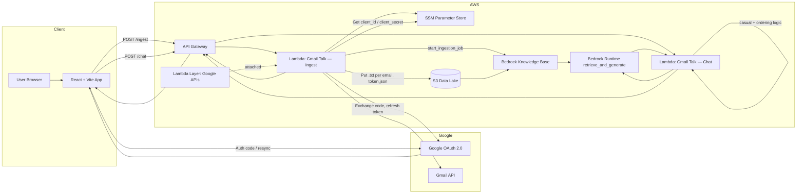

# Gmail Talk AI: Serverless Gmail Intelligence Platform

Gmail Talk AI is an AI-powered dashboard that lets users securely connect Gmail via **OAuth 2.0**, sync recent messages into an **AWS S3 data lake**, and ask natural-language questions using **Retrieval-Augmented Generation (RAG)** powered by **Amazon Bedrock Knowledge Bases**.

**Production (Vercel):** [https://gmailchatbot.vercel.app/](https://gmailchatbot.vercel.app/)

---

## Table of Contents

1. [Start-to-Finish Guide (New Engineer)](#1-start-to-finish-guide-new-engineer)
2. [Project Overview](#2-project-overview)
3. [Technical Architecture](#3-technical-architecture)
4. [Google Cloud Setup](#4-google-cloud-setup-prerequisites)
5. [AWS Backend Configuration](#5-aws-backend-configuration)
6. [Lambda Dependencies and Layers](#6-lambda-dependencies-and-layers)
7. [Bedrock Knowledge Base](#7-bedrock-knowledge-base)
8. [IAM Permissions](#8-iam-permissions-least-privilege)
9. [Frontend (React + Vite)](#9-frontend-react--vite)
10. [Local Setup & Deployment](#10-local-setup--deployment)
11. [Repository Layout](#11-repository-layout)
12. [Security Reminders](#12-security-reminders)

---

## 1. Start-to-Finish Guide (New Engineer)

Follow this order to go from zero to a working deployment.

| Step | What to do | Section |
|------|------------|---------|
| 1 | Understand the flow (OAuth → ingest Lambda → Gmail → S3 → Bedrock KB → chat Lambda) | [§2](#2-project-overview), [§3](#3-technical-architecture) |
| 2 | Create Google Cloud project, enable Gmail API, OAuth client, add redirect URIs | [§4](#4-google-cloud-setup-prerequisites) |
| 3 | Create S3 bucket, SSM parameters (`/gmind/client_id`, `/gmind/client_secret`), IAM roles | [§5](#5-aws-backend-configuration), [§8](#8-iam-permissions-least-privilege) |
| 4 | Create Bedrock Knowledge Base (S3 data source, **No chunking**) | [§7](#7-bedrock-knowledge-base) |
| 5 | **Build and attach the Google Lambda Layer** (required for ingest) | [§6](#6-lambda-dependencies-and-layers) |
| 6 | Deploy **ingest** Lambda (`lambda/GMind-Gmail-Ingestor-Sevenprs_lambda_function.py`) + layer | [§6](#6-lambda-dependencies-and-layers), [§5.3](#53-lambda-gmail-talk--ingest-gmind-gmail-ingestor) |
| 7 | Deploy **chat** Lambda (`lambda/GMind-Chat-Engine_lambda_function.py`) — no Google layer | [§5.4](#54-lambda-gmail-talk--chat-gmind-chat-engine), [§10.5](#105-deploy-lambda-function-code) |
| 8 | Wire API Gateway `POST /ingest` and `POST /chat` | [§5.5](#55-api-gateway) |
| 9 | Clone repo, run UI locally (`npm install` / `npm run dev`) — **no** `pip install` for Google libs on your laptop for Lambda | [§10](#10-local-setup--deployment) |
| 10 | Deploy UI to Vercel; set `OAUTH_REDIRECT_URI` and Google OAuth to production URL | [§10.4](#104-deploy-ui-to-vercel) |

**API endpoints (this deployment):**

- Ingest: `https://t5m3be9xfi.execute-api.us-east-1.amazonaws.com/dev/ingest`
- Chat: same base, replace `/ingest` with `/chat`

---

## 2. Project Overview

Gmail Talk AI provides a single-page experience:

| Capability | Description |
|------------|-------------|
| **Secure Gmail access** | Users sign in with Google; the **authorization code** is exchanged for tokens **only on the server** (ingest Lambda). |
| **Sync Feed** | Latest messages (configurable 10–100) appear in a left-hand panel with sender, subject, snippet, and local-time dates. |
| **Silent resync** | **Resync** re-fetches mail using a refresh token stored in S3—no Google popup after the first consent. |
| **Email intelligence chat** | Users ask questions in plain English; answers combine **Bedrock RAG**, deterministic ordering for “latest/first/second”, and friendly small-talk handling. |
| **Knowledge indexing** | Each sync writes **one `.txt` file per email** under `s3://<bucket>/ingest/` and triggers a Bedrock **ingestion job**. |

**Design principles**

- **No secrets in the browser** — only the public Google Client ID and API URLs belong in the frontend.
- **No `emails.json` in S3** — the UI uses the ingest API response and `localStorage`; S3 holds KB `.txt` files and the OAuth refresh token only.
- **Serverless** — API Gateway + Lambda + S3 + Bedrock; UI hosted on [Vercel](https://gmailchatbot.vercel.app/).

**How data moves (short)**

1. Browser gets Google OAuth **code** → sends to **ingest Lambda**.
2. Ingest Lambda exchanges code (or uses refresh token from S3) → calls **Gmail API** → returns `emails[]` to UI.
3. Ingest Lambda writes **one `.txt` per email** to `s3://<bucket>/ingest/` → starts **Bedrock ingestion job**.
4. User chats → **chat Lambda** uses `emails[]` + **Bedrock retrieve_and_generate** on the Knowledge Base.

---

## 3. Technical Architecture

### End-to-end flow



### Request paths

| Action | Frontend | API route | Lambda |
|--------|----------|-----------|--------|
| Sign in / Resync | `useGoogleLogin` → `POST` body `{ code, limit }` or `{ limit }` | `POST /dev/ingest` | **Gmail Talk — Ingest** (AWS name e.g. `GMind-Gmail-Ingestor`) |
| Chat | `handleChat` → `POST` body `{ question, emails }` | `POST /dev/chat` | **Gmail Talk — Chat** (AWS name e.g. `GMind-Chat-Engine`) |

### Cost-aware building blocks

| Service | Role |
|---------|------|
| **Lambda** | Pay per invoke |
| **API Gateway** | HTTP front door |
| **S3** | Email `.txt` files + OAuth token |
| **SSM** | OAuth client secret (not in Git) |
| **Bedrock KB** | RAG over `ingest/*.txt` |
| **Vercel** | Static React UI |

> Bedrock inference during chat and KB sync is the main variable cost.

---

## 4. Google Cloud Setup (Prerequisites)

### 4.1 Enable APIs

1. [Google Cloud Console](https://console.cloud.google.com/) → select project.
2. **APIs & Services → Library** → enable:
   - **Gmail API**
   - **Google People API** (profile via `userinfo`)

### 4.2 OAuth consent screen

1. **OAuth consent screen** → Internal or External.
2. Scopes (must match ingest Lambda `SCOPES`):
   - `https://www.googleapis.com/auth/gmail.readonly`
   - `openid`
   - `https://www.googleapis.com/auth/userinfo.email`
   - `https://www.googleapis.com/auth/userinfo.profile`

### 4.3 OAuth 2.0 Client ID (Web application)

1. **Credentials → Create credentials → OAuth client ID** → **Web application**.
2. **Authorized JavaScript origins**
   - `http://localhost:5173`
   - `https://gmailchatbot.vercel.app` — [production UI](https://gmailchatbot.vercel.app/)
3. **Authorized redirect URIs** (must equal ingest Lambda `OAUTH_REDIRECT_URI` exactly, no trailing path)
   - `http://localhost:5173`
   - `https://gmailchatbot.vercel.app`
4. **Client ID** → frontend / `VITE_GOOGLE_CLIENT_ID`.
5. **Client secret** → SSM `/gmind/client_secret` only.

### 4.4 Refresh tokens

Frontend uses `@react-oauth/google` with `flow: 'auth-code'` and `prompt: 'consent'` so Google issues a **refresh_token**, stored at `s3://<bucket>/private/token.json` for silent **Resync**.

---

## 5. AWS Backend Configuration

### 5.1 SSM Parameter Store

Ingest Lambda loads credentials via `get_google_secrets()`:

| SSM path | Type | Purpose |
|----------|------|---------|
| `/gmind/client_id` | String | OAuth Client ID |
| `/gmind/client_secret` | SecureString | OAuth Client Secret |

Optional env overrides: `SSM_GOOGLE_CLIENT_ID`, `SSM_GOOGLE_CLIENT_SECRET`.

### 5.2 S3 data lake layout

Default bucket: `lexiguard-gmail-data-ps-b402` (`S3_BUCKET` env).

```
s3://<bucket>/
├── ingest/
│   ├── 001_<gmailMessageId>.txt    # One plain-text doc per email (KB source)
│   └── ...
└── private/
    └── token.json                  # OAuth refresh token
```

Each `.txt` includes Gmail id, sync order, `Received:` (default `Asia/Kolkata`), From, To, Subject, snippet. On each sync, old `ingest/*.txt` is deleted before re-upload.

### 5.3 Lambda: Gmail Talk — Ingest (`GMind-Gmail-Ingestor`)

**Source:** `lambda/GMind-Gmail-Ingestor-Sevenprs_lambda_function.py`

| Responsibility | Implementation |
|----------------|----------------|
| OAuth | `google_auth_oauthlib.flow.Flow` |
| Gmail fetch | `build("gmail", "v1")` → `users().messages().list` / `.get` |
| KB export | `_upload_kb_documents()` → S3 `ingest/*.txt` |
| KB sync | `bedrock-agent.start_ingestion_job` |

**Gmail API location in code:** after credentials are ready, ~lines 249–254:

```python
gmail = build("gmail", "v1", credentials=creds)
results = gmail.users().messages().list(userId="me", maxResults=email_limit).execute()
# ...
m = gmail.users().messages().get(userId="me", id=msg["id"]).execute()
```

**Environment variables**

| Variable | Required | Description |
|----------|----------|-------------|
| `S3_BUCKET` | No | Default `lexiguard-gmail-data-ps-b402` |
| `KB_S3_PREFIX` | No | Default `ingest/` |
| `TOKEN_S3_KEY` | No | Default `private/token.json` |
| `OAUTH_REDIRECT_URI` | Yes* | e.g. `https://gmailchatbot.vercel.app` or `http://localhost:5173` |
| `KB_ID` | For auto-sync | Bedrock Knowledge Base ID |
| `DATA_SOURCE_ID` | For auto-sync | Data source with **No chunking** |
| `DISPLAY_TIMEZONE` | No | Default `Asia/Kolkata` |

\*Must match Google OAuth redirect URI.

> **This function requires the Google Lambda Layer** ([§6](#6-lambda-dependencies-and-layers)). Do not deploy the `.py` file alone without the layer.

### 5.4 Lambda: Gmail Talk — Chat (`GMind-Chat-Engine`)

**Source:** `lambda/GMind-Chat-Engine_lambda_function.py`

Uses **only** `boto3` (provided by Lambda runtime). No Google layer.

| Step | Behavior |
|------|----------|
| 1 | Casual replies (hi, thanks, etc.) |
| 2 | Ordering from `emails[]` (`sync_order`) |
| 3 | `bedrock_agent_runtime.retrieve_and_generate()` |

| Variable | Required | Description |
|----------|----------|-------------|
| `KB_ID` | Yes | Knowledge Base ID |
| `BEDROCK_MODEL_ARN` | No | Default Claude 3 Sonnet |
| `KB_NUM_RESULTS` | No | Default `25` |
| `BEDROCK_TEMPERATURE` | No | Default `0.1` |

### 5.5 API Gateway

- Lambda proxy: `POST /ingest`, `POST /chat`.
- CORS: `Access-Control-Allow-Origin: *` (tighten to `https://gmailchatbot.vercel.app` in production).

---

## 6. Lambda Dependencies and Layers

AWS Lambda runtimes include **`boto3`** and the Python standard library. They do **not** include Google client libraries. The **ingest** function imports third-party Google packages; those must be supplied via a **Lambda Layer** (or a Linux-compatible deployment package built the same way).

### 6.1 Libraries confirmed from source code

From `lambda/GMind-Gmail-Ingestor-Sevenprs_lambda_function.py`:

| Import in code | Provided by (install for layer) |
|----------------|----------------------------------|
| `from google.auth.transport.requests import Request` | `google-auth` (pulled in as dependency) |
| `from google.oauth2.credentials import Credentials` | `google-auth` |
| `from google_auth_oauthlib.flow import Flow` | **`google-auth-oauthlib`** |
| `from googleapiclient.discovery import build` | **`google-api-python-client`** |

**Chat Lambda** (`lambda/GMind-Chat-Engine_lambda_function.py`) imports only `boto3` — **no Google layer required**.

### 6.2 The problem

`google-api-python-client` and `google-auth-oauthlib` (and their dependencies, including `google-auth` and `cryptography`) are **not native** to the AWS Lambda Python runtime. If you zip the handler alone or `pip install` on Windows into the deployment zip without targeting **Amazon Linux**, you will often see:

- `ModuleNotFoundError: No module named 'googleapiclient'`
- `ModuleNotFoundError: No module named 'google_auth_oauthlib'`
- Import errors for `cryptography` / `_cffi_backend` (wrong OS/architecture binaries)

**Solution:** package dependencies for **Lambda’s Linux environment** and attach them as a **Layer**, or use the exact `pip` command below when building that layer.

### 6.3 Folder structure requirement

Lambda layers expect dependencies under a top-level folder named exactly:

```
python/
```

At runtime, Python adds `/opt/python` to `sys.path`, so imports resolve when libraries live inside `python/` in the zip (not at the zip root).

**Correct layer zip layout:**

```
python/
├── google/
├── googleapiclient/
├── google_auth_oauthlib/
├── ... (other installed packages)
```

**Incorrect:** zipping `site-packages` or library folders directly without the `python/` parent.

### 6.4 Lambda Layer Setup (step-by-step)

#### Step 1 — Create working folders

From any working directory (e.g. repo root or `C:\temp`):

```text
google-layer/
└── python/          ← create empty python/ inside google-layer
```

#### Step 2 — Install for AWS Linux from Windows

`cd` into **`google-layer`** (the folder that contains `python/`), then run:

```bash
pip install --platform manylinux2014_x86_64 --target python/ --implementation cp --python-version 3.11 --only-binary=:all: google-api-python-client google-auth-oauthlib
```

| Flag | Why |
|------|-----|
| `--platform manylinux2014_x86_64` | Matches Lambda’s Amazon Linux x86_64 environment |
| `--target python/` | Required layer layout |
| `--python-version 3.11` | Match your Lambda runtime (adjust if you use 3.12) |
| `--only-binary=:all:` | Avoid building native wheels on Windows (prevents cryptography failures) |

> Use the same Python major version as the Lambda runtime. If Lambda uses **Python 3.12**, change `3.11` to `3.12` in the command.

#### Step 3 — Package the layer

Zip **only** the `python` folder (not `google-layer` itself):

**Windows (PowerShell), from inside `google-layer`:**

```powershell
Compress-Archive -Path python -DestinationPath google-layer.zip -Force
```

**Linux / macOS:**

```bash
cd google-layer
zip -r google-layer.zip python
```

#### Step 4 — Upload to AWS

1. **Lambda console** → **Layers** → **Create layer**.
2. Upload `google-layer.zip`.
3. Compatible runtime: **Python 3.11** (or your runtime).
4. Compatible architecture: **x86_64** (unless your function is arm64).

#### Step 5 — Attach to the ingest function

1. Open **`GMind-Gmail-Ingestor`** (or your ingest function name).
2. **Layers** → **Add a layer** → select the Google layer.
3. Deploy / publish a new function version if prompted.

Upload **`lambda/GMind-Gmail-Ingestor-Sevenprs_lambda_function.py`** as the function code (single file or small zip with only that handler). **Do not** bundle Google libraries inside the function zip if they are already on the layer.

#### Step 6 — Verify

Test `POST /ingest` with a valid OAuth `code`. CloudWatch should show Gmail fetch success, not import errors.

### 6.5 Chat Lambda packaging

Zip and deploy only `lambda/GMind-Chat-Engine_lambda_function.py`. Runtime `boto3` is sufficient; **no Google layer**.

---

## 7. Bedrock Knowledge Base

| Setting | Value |
|---------|--------|
| **Name** | e.g. `GmailTalk-Email-KB` |
| **Embeddings** | Amazon Titan Text Embeddings v2 (region-dependent) |
| **Vector store** | S3 Vectors (demo-friendly) |
| **Data source** | `s3://<bucket>/` — index **`ingest/*.txt`** only |
| **Chunking** | **No chunking** (one file = one email) |

If chunking cannot be changed on an old data source, create a **new** data source with **No chunking** and update ingest Lambda `DATA_SOURCE_ID`.

After each sync, ingest calls `start_ingestion_job` (or sync manually in the console).

---

## 8. IAM Permissions (Least Privilege)

### Ingest Lambda role (example)

```json
{
  "Version": "2012-10-17",
  "Statement": [
    {
      "Sid": "SSMGoogleOAuth",
      "Effect": "Allow",
      "Action": ["ssm:GetParameter"],
      "Resource": [
        "arn:aws:ssm:*:*:parameter/gmind/client_id",
        "arn:aws:ssm:*:*:parameter/gmind/client_secret"
      ]
    },
    {
      "Sid": "S3ListIngestAndPrivate",
      "Effect": "Allow",
      "Action": ["s3:ListBucket"],
      "Resource": "arn:aws:s3:::lexiguard-gmail-data-ps-b402",
      "Condition": {
        "StringLike": { "s3:prefix": ["ingest/*", "private/*"] }
      }
    },
    {
      "Sid": "S3ObjectReadWriteDelete",
      "Effect": "Allow",
      "Action": ["s3:GetObject", "s3:PutObject", "s3:DeleteObject"],
      "Resource": "arn:aws:s3:::lexiguard-gmail-data-ps-b402/*"
    },
    {
      "Sid": "BedrockStartIngestion",
      "Effect": "Allow",
      "Action": ["bedrock:StartIngestionJob"],
      "Resource": [
        "arn:aws:bedrock:us-east-1:<account-id>:knowledge-base/<KB_ID>",
        "arn:aws:bedrock:us-east-1:<account-id>:knowledge-base/<KB_ID>/data-source/*"
      ]
    }
  ]
}
```

### Chat Lambda role (example)

```json
{
  "Version": "2012-10-17",
  "Statement": [
    {
      "Sid": "BedrockRetrieveAndGenerate",
      "Effect": "Allow",
      "Action": ["bedrock:Retrieve", "bedrock:RetrieveAndGenerate"],
      "Resource": "arn:aws:bedrock:us-east-1:<account-id>:knowledge-base/<KB_ID>"
    },
    {
      "Sid": "BedrockInvokeModel",
      "Effect": "Allow",
      "Action": ["bedrock:InvokeModel"],
      "Resource": "arn:aws:bedrock:us-east-1::foundation-model/anthropic.claude-3-sonnet-*"
    }
  ]
}
```

Grant the Knowledge Base service role `s3:GetObject` / `ListBucket` on `ingest/*`.

---

## 9. Frontend (React + Vite)

**Entry:** `src/main.jsx` → `src/App.jsx`

| Package | Use |
|---------|-----|
| `@react-oauth/google` | OAuth auth-code flow |
| `axios` | Ingest + chat API calls |
| `tailwindcss` | UI styling |

| State | Storage |
|-------|---------|
| `user` | `localStorage` (`gmind_session`) |
| `emails` | `localStorage` (`gmind_emails`) |
| `chatHistory` | In-memory only |

**Production env (Vercel):**

```env
VITE_GOOGLE_CLIENT_ID=...
VITE_AWS_API_URL=https://....amazonaws.com/dev/ingest
```

---

## 10. Local Setup & Deployment

### 10.1 What runs locally vs in AWS

| Component | Local machine | AWS |
|-----------|---------------|-----|
| **React UI** | `npm install`, `npm run dev` | Vercel serves `dist/` |
| **Google libraries for Gmail** | **Not required** for local UI work | **Lambda Layer** on ingest function ([§6](#6-lambda-dependencies-and-layers)) |
| **Ingest / Chat Lambdas** | Not executed locally in this guide | Deployed zip + layer in AWS |

> **Important:** Running `pip install google-api-python-client` on your Windows laptop does **not** deploy those packages to Lambda. The ingest function only works in AWS after the **layer** (or a Linux-built `python/` zip) is attached. Local `pip` is optional and only if you intentionally run the ingest script outside Lambda on your machine—not part of the standard UI developer workflow.

### 10.2 Prerequisites

- Node.js 18+
- npm
- Google OAuth client ([§4](#4-google-cloud-setup-prerequisites))
- Deployed AWS: API Gateway, both Lambdas, **Google layer on ingest**, S3, SSM, Bedrock KB

### 10.3 Local UI development

```bash
cd path/to/your-repo
npm install
npm run dev
```

Open `http://localhost:5173`.

- Point `VITE_AWS_API_URL` / `AWS_API_URL` at your deployed **ingest** API.
- Set ingest Lambda `OAUTH_REDIRECT_URI=http://localhost:5173` and add that URI in Google Console for local sign-in.
- Production: `OAUTH_REDIRECT_URI=https://gmailchatbot.vercel.app` — [live app](https://gmailchatbot.vercel.app/).

### 10.4 Deploy UI to Vercel

1. Push repo to GitHub.
2. [vercel.com](https://vercel.com) → import project → preset **Vite**.
3. Build: `npm run build` — Output: `dist`.
4. Env: `VITE_GOOGLE_CLIENT_ID`, `VITE_AWS_API_URL`.
5. Production URL for this project: **https://gmailchatbot.vercel.app**
6. Add that URL to Google OAuth origins + redirect URIs.
7. Set ingest Lambda `OAUTH_REDIRECT_URI=https://gmailchatbot.vercel.app` (no trailing slash).

### 10.5 Deploy Lambda function code

| Function | Code artifact | Layer |
|----------|---------------|--------|
| **GMind-Gmail-Ingestor** | `lambda/GMind-Gmail-Ingestor-Sevenprs_lambda_function.py` | **Google layer** ([§6](#6-lambda-dependencies-and-layers)) |
| **GMind-Chat-Engine** | `lambda/GMind-Chat-Engine_lambda_function.py` | None (boto3 in runtime) |

After code or layer changes, test `/ingest` (sign-in + resync) and `/chat` via the UI or API Gateway test console.

---

## 11. Repository Layout

```
gmail-talk-ai/   (or gmind-ui/)
├── src/
│   ├── App.jsx              # OAuth, sync feed, chat
│   ├── main.jsx
│   └── index.css
├── lambda/
│   ├── GMind-Gmail-Ingestor-Sevenprs_lambda_function.py   # Requires Google Lambda Layer
│   └── GMind-Chat-Engine_lambda_function.py               # boto3 only
├── archive/                 # Old UI backups
├── package.json
├── vite.config.js
└── README.md
```

Layer build artifacts (`google-layer/`, `google-layer.zip`) are typically **not** committed—build per [§6](#6-lambda-dependencies-and-layers).

---

## 12. Security Reminders

- Never commit `/gmind/client_secret`, `.env`, or `private/token.json`.
- Restrict Google OAuth **test users** during demos.
- Tighten CORS from `*` to `https://gmailchatbot.vercel.app` in production.
- `localStorage` is not encrypted—suitable for demos only.

---

## License

Private / demo use — adjust for your organization’s policies.
