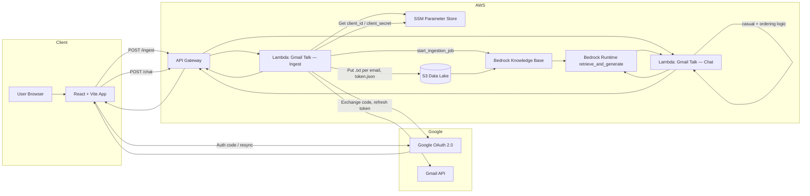

# Gmail Talk AI: Serverless Gmail Intelligence Platform

Gmail Talk AI is an AI-powered dashboard that lets users securely connect Gmail via **OAuth 2.0**, sync recent messages into an **AWS S3 data lake**, and ask natural-language questions using **Retrieval-Augmented Generation (RAG)** powered by **Amazon Bedrock Knowledge Bases**.

**Production (Vercel):** [https://gmailchatbot.vercel.app/](https://gmailchatbot.vercel.app/)

---

## Table of Contents

1. [Project Overview](#1-project-overview)
2. [Technical Architecture](#2-technical-architecture)
3. [Google Cloud Setup](#3-google-cloud-setup-prerequisites)
4. [AWS Backend Configuration](#4-aws-backend-configuration)
5. [Bedrock Knowledge Base](#5-bedrock-knowledge-base)
6. [IAM Permissions](#6-iam-permissions-least-privilege)
7. [Frontend (React + Vite)](#7-frontend-react--vite)
8. [Local Setup & Deployment](#8-local-setup--deployment)
9. [Repository Layout](#9-repository-layout)

---

## 1. Project Overview

Gmail Talk AI provides a single-page experience:

| Capability | Description |
|------------|-------------|
| **Secure Gmail access** | Users sign in with Google; the **authorization code** is exchanged for tokens **only on the server** (ingest Lambda). |
| **Sync Feed** | Latest messages (configurable 10–100) appear in a left-hand panel with sender, subject, snippet, and local-time dates. |
| **Silent resync** | **Resync** re-fetches mail using a refresh token stored in S3—no Google popup after the first consent. |
| **Email intelligence chat** | Users ask questions in plain English; answers combine **Bedrock RAG**, deterministic ordering for “latest/first/second”, and friendly small-talk handling. |
| **Knowledge indexing** | Each sync writes **one `.txt` file per email** under `s3://<bucket>/ingest/` and triggers a Bedrock **ingestion job**. |

**Design principles**

- **No secrets in the browser** — only the public Google Client ID and API URLs belong in the frontend.
- **No `emails.json` in S3** — the UI uses the ingest API response and `localStorage`; S3 holds KB `.txt` files and the OAuth refresh token only.
- **Serverless** — API Gateway + Lambda + S3 + Bedrock; UI can be hosted on Vercel (free tier).

---

## 2. Technical Architecture

### End-to-end flow



### Request paths

| Action | Frontend | API route | Lambda |
|--------|----------|-----------|--------|
| Sign in / Resync | `useGoogleLogin` → `POST` body `{ code, limit }` or `{ limit }` | `POST /dev/ingest` | **Gmail Talk — Ingest** (e.g. `GMind-Gmail-Ingestor` in AWS) |
| Chat | `handleChat` → `POST` body `{ question, emails }` | `POST /dev/chat` | **Gmail Talk — Chat** (e.g. `GMind-Chat-Engine` in AWS) |

Default API base (configure in `src/App.jsx` or env):

`https://t5m3be9xfi.execute-api.us-east-1.amazonaws.com/dev/ingest`

Chat URL is derived by replacing `/ingest` with `/chat`.

### Why serverless & low-cost building blocks?

| Service | Role | Cost profile |
|---------|------|----------------|
| **Lambda** | Pay per invoke; no idle servers | Free tier friendly for demos |
| **API Gateway** | HTTP front door | Low traffic = cents |
| **S3** | Durable object storage for emails + tokens | Pennies for small demos |
| **SSM Parameter Store** | Secure config (no secrets in Git) | Standard parameters are inexpensive |
| **Bedrock KB + S3 vector store** | RAG without self-managed OpenSearch | Lower ops burden than OpenSearch Serverless |
| **Vercel** (optional) | Static hosting for React `dist/` | Hobby tier free |

> **Note:** Bedrock inference (chat + embedding during sync) is the main variable cost—not the React host.

---

## 3. Google Cloud Setup (Prerequisites)

### 3.1 Enable APIs

1. Open [Google Cloud Console](https://console.cloud.google.com/).
2. Select or create a project.
3. Go to **APIs & Services → Library**.
4. Enable:
   - **Gmail API**
   - **Google People API** (used for profile via `userinfo`)

### 3.2 OAuth consent screen

1. **APIs & Services → OAuth consent screen**.
2. Choose user type:
   - **Internal** — only users in your Google Workspace org (simplest for company demos).
   - **External** — any Google account; requires **test users** while in *Testing*, or verification for production.
3. Add scopes (must match the app):
   - `https://www.googleapis.com/auth/gmail.readonly`
   - `openid`
   - `https://www.googleapis.com/auth/userinfo.email`
   - `https://www.googleapis.com/auth/userinfo.profile`

### 3.3 OAuth 2.0 Client ID (Web application)

1. **APIs & Services → Credentials → Create credentials → OAuth client ID**.
2. Type: **Web application**.
3. **Authorized JavaScript origins**
   - `http://localhost:5173`
   - `https://gmailchatbot.vercel.app` — production UI for this repo ([live app](https://gmailchatbot.vercel.app/))
   - `https://<your-app>.vercel.app` — add your URL if you deploy a separate Vercel project
4. **Authorized redirect URIs** (must match `OAUTH_REDIRECT_URI` on the ingest Lambda exactly)
   - `http://localhost:5173`
   - `https://gmailchatbot.vercel.app`
   - `https://<your-app>.vercel.app` (if applicable)
5. Copy **Client ID** → frontend (`GOOGLE_CLIENT_ID` or `VITE_GOOGLE_CLIENT_ID`).
6. Copy **Client secret** → **SSM only** (`/gmind/client_secret`), never the React bundle.

### 3.4 First-time consent & refresh tokens

The frontend uses `@react-oauth/google` with `flow: 'auth-code'` and `prompt: 'consent'` so Google issues a **refresh_token**. That token is saved to `s3://<bucket>/private/token.json` for silent **Resync**.

---

## 4. AWS Backend Configuration

### 4.1 Security — SSM Parameter Store

The ingest Lambda loads Google credentials via `get_google_secrets()`:

| SSM path | Type | Purpose |
|----------|------|---------|
| `/gmind/client_id` | String | OAuth Client ID |
| `/gmind/client_secret` | **SecureString** | OAuth Client Secret (`WithDecryption=True`) |

Override paths with Lambda environment variables:

- `SSM_GOOGLE_CLIENT_ID` (default `/gmind/client_id`)
- `SSM_GOOGLE_CLIENT_SECRET` (default `/gmind/client_secret`)

**Do not** commit secrets to Git or embed the client secret in `App.jsx`.

### 4.2 S3 data lake layout

Default bucket: `lexiguard-gmail-data-ps-b402` (override with `S3_BUCKET`).

```
s3://<bucket>/
├── ingest/
│   ├── 001_<gmailMessageId>.txt    # One plain-text doc per email (Bedrock KB source)
│   ├── 002_<gmailMessageId>.txt
│   └── ...
└── private/
    └── token.json                  # OAuth token JSON (refresh_token for resync)
```

Each `.txt` file includes:

- `Gmail message id`, `Sync order` (internal; rank 1 = newest in sync)
- `Received:` in `dd-mm-yyyy hh:mm am/pm` (default timezone `Asia/Kolkata` via `DISPLAY_TIMEZONE`)
- `From`, `To`, `Subject`, `Body snippet`

On each sync, the ingestor **deletes** previous `ingest/*.txt` and legacy `ingest/emails.json` before uploading new files.

> If your Knowledge Base uses **S3 Vectors**, Bedrock may also maintain vector/index metadata under additional prefixes configured in the console. Application code only writes `ingest/` and `private/`.

### 4.3 Lambda: Gmail Talk — Ingest (`GMind-Gmail-Ingestor`)

**Source:** `lambda/GMind-Gmail-Ingestor-Sevenprs_lambda_function.py`

| Responsibility | Implementation |
|----------------|----------------|
| OAuth | `google_auth_oauthlib.flow.Flow` — exchange `code` or load token from S3 |
| Gmail fetch | `users().messages().list` + `messages().get` (snippet + headers) |
| KB export | `_upload_kb_documents()` → one `.txt` per message under `ingest/` |
| KB sync trigger | `bedrock-agent.start_ingestion_job(KB_ID, DATA_SOURCE_ID)` |
| API response | `{ status, user, emails[], kb_files_written }` for the UI |

**Environment variables**

| Variable | Required | Description |
|----------|----------|-------------|
| `S3_BUCKET` | No | Default `lexiguard-gmail-data-ps-b402` |
| `KB_S3_PREFIX` | No | Default `ingest/` |
| `TOKEN_S3_KEY` | No | Default `private/token.json` |
| `OAUTH_REDIRECT_URI` | Yes* | Must match Google OAuth redirect (e.g. `http://localhost:5173`) |
| `KB_ID` | For auto-sync | Bedrock Knowledge Base ID |
| `DATA_SOURCE_ID` | For auto-sync | Data source ID (use **No chunking** data source) |
| `DISPLAY_TIMEZONE` | No | Default `Asia/Kolkata` for `Received:` in `.txt` files |

\*Required for sign-in; must match Google Console redirect URI.

### 4.4 Lambda: Gmail Talk — Chat (`GMind-Chat-Engine`)

**Source:** `lambda/GMind-Chat-Engine_lambda_function.py`

| Step | Behavior |
|------|----------|
| 1 | `_try_casual_reply()` — greetings, thanks, ok, bye (no KB) |
| 2 | `_try_ordering_answer()` — latest / first / second using `emails[]` from the request (`sync_order`) |
| 3 | `bedrock_agent_runtime.retrieve_and_generate()` — semantic Q&A over the Knowledge Base |

**Environment variables**

| Variable | Required | Description |
|----------|----------|-------------|
| `KB_ID` | Yes | Knowledge Base ID |
| `BEDROCK_MODEL_ARN` | No | Default Claude 3 Sonnet |
| `KB_NUM_RESULTS` | No | Default `25` retrieved chunks |
| `BEDROCK_TEMPERATURE` | No | Default `0.1` |

### 4.5 API Gateway

- **Lambda proxy integration** for `POST /ingest` and `POST /chat`.
- **CORS:** Lambdas return `Access-Control-Allow-Origin: *` (tighten to your Vercel domain for production).
- **OPTIONS** supported on the chat Lambda for preflight.

---

## 5. Bedrock Knowledge Base

### Recommended configuration

| Setting | Value |
|---------|--------|
| **Knowledge base name** | e.g. `GmailTalk-Email-KB` |
| **Embeddings** | Amazon **Titan Text Embeddings v2** (or model available in your region) |
| **Vector store** | **S3 Vectors** (cost-effective vs. OpenSearch Serverless for demos) |
| **Data source S3 URI** | `s3://<bucket>/` with inclusion/lifecycle so only **`ingest/*.txt`** is indexed |
| **Chunking** | **No chunking** (one file = one email) |
| **Parsing** | Default |

> Chunking cannot be changed on an existing data source in some consoles—create a **new** data source with **No chunking** and update `DATA_SOURCE_ID` on the ingest Lambda.

### Semantic grounding & prompts

- Ingested `.txt` files carry structured **Received** timestamps and **Sync order** for ranking.
- The chat Lambda **prompt template** instructs the model to use `Received:` for comparisons and to avoid exposing internal rank/IDs in answers.
- For **latest / first / second** questions, the chat Lambda answers from the **`emails` array** sent by the UI (same order as the Sync Feed) before calling Bedrock—improving accuracy vs. retrieval-only.

After each ingest or resync, run **Sync** on the data source (or rely on `start_ingestion_job` from the ingest Lambda).

---

## 6. IAM Permissions (Least Privilege)

### Ingest Lambda role (example)

```json
{
  "Version": "2012-10-17",
  "Statement": [
    {
      "Sid": "SSMGoogleOAuth",
      "Effect": "Allow",
      "Action": ["ssm:GetParameter"],
      "Resource": [
        "arn:aws:ssm:*:*:parameter/gmind/client_id",
        "arn:aws:ssm:*:*:parameter/gmind/client_secret"
      ]
    },
    {
      "Sid": "S3ListIngestAndPrivate",
      "Effect": "Allow",
      "Action": ["s3:ListBucket"],
      "Resource": "arn:aws:s3:::lexiguard-gmail-data-ps-b402",
      "Condition": {
        "StringLike": { "s3:prefix": ["ingest/*", "private/*"] }
      }
    },
    {
      "Sid": "S3ObjectReadWriteDelete",
      "Effect": "Allow",
      "Action": ["s3:GetObject", "s3:PutObject", "s3:DeleteObject"],
      "Resource": "arn:aws:s3:::lexiguard-gmail-data-ps-b402/*"
    },
    {
      "Sid": "BedrockStartIngestion",
      "Effect": "Allow",
      "Action": ["bedrock:StartIngestionJob"],
      "Resource": [
        "arn:aws:bedrock:us-east-1:<account-id>:knowledge-base/<KB_ID>",
        "arn:aws:bedrock:us-east-1:<account-id>:knowledge-base/<KB_ID>/data-source/*"
      ]
    }
  ]
}
```

### Chat Lambda role (example)

```json
{
  "Version": "2012-10-17",
  "Statement": [
    {
      "Sid": "BedrockRetrieveAndGenerate",
      "Effect": "Allow",
      "Action": ["bedrock:Retrieve", "bedrock:RetrieveAndGenerate"],
      "Resource": "arn:aws:bedrock:us-east-1:<account-id>:knowledge-base/<KB_ID>"
    },
    {
      "Sid": "BedrockInvokeModel",
      "Effect": "Allow",
      "Action": ["bedrock:InvokeModel"],
      "Resource": "arn:aws:bedrock:us-east-1::foundation-model/anthropic.claude-3-sonnet-*"
    }
  ]
}
```

### Knowledge Base service role

Grant the KB role `s3:GetObject` / `ListBucket` on `ingest/*` (and vector-store paths Bedrock creates if using S3 Vectors).

Replace `<account-id>` and `<KB_ID>` with your values.

---

## 7. Frontend (React + Vite)

**Entry:** `src/main.jsx` → `src/App.jsx`

### Key libraries

| Package | Use |
|---------|-----|
| `@react-oauth/google` | `GoogleOAuthProvider`, `useGoogleLogin` (auth-code flow, `prompt: 'consent'`) |
| `axios` | `POST` to ingest and chat API Gateway endpoints |
| `tailwindcss` | Layout and dark theme |
| `lucide-react` | Icons (Mail, Sparkles, MessageSquare, etc.) |

### State & persistence

| State | Storage | Purpose |
|-------|---------|---------|
| `user` | `localStorage` (`gmind_session`) | Name, email, profile picture |
| `emails` | `localStorage` (`gmind_emails`) | Sync Feed until logout |
| `chatHistory` | Memory only | Chat transcript (session) |

### Notable UI behavior

- **Sync Feed** — displays emails from the ingest API; dates via `formatEmailDate()` (browser local time from `received_at_iso`).
- **Resync** — `handleResync()` posts `{ limit }` without `code`; loading overlay on feed **and** chat panel; scroll locked during sync.
- **Chat** — `handleChat()` sends `question` + `emails` metadata to `/chat`; auto-scroll on new messages and while typing.
- **Toasts & confirm dialog** — success/error toasts; logout confirmation modal.

### Configuration (current)

```javascript
// src/App.jsx — prefer environment variables for production
const GOOGLE_CLIENT_ID = "..."; 
const AWS_API_URL = "https://....amazonaws.com/dev/ingest";
```

Recommended for Vercel:

```env
VITE_GOOGLE_CLIENT_ID=...
VITE_AWS_API_URL=https://....amazonaws.com/dev/ingest
```

---

## 8. Local Setup & Deployment

### 8.1 Prerequisites

- Node.js 18+
- npm
- Google OAuth client (Section 3)
- Deployed AWS stack: API Gateway, both Lambdas, S3, SSM params, Bedrock KB

### 8.2 Local development

```bash
cd path/to/your-repo   # e.g. gmail-talk-ai or gmind-ui
npm install
npm run dev
```

Open `http://localhost:5173`.

Ensure ingest Lambda `OAUTH_REDIRECT_URI` matches Google Console: `http://localhost:5173` for local dev, or `https://gmailchatbot.vercel.app` for [production](https://gmailchatbot.vercel.app/) (no trailing path).

### 8.3 Build

```bash
npm run build
```

Output: `dist/` (static assets for hosting).

### 8.4 Deploy UI to Vercel

1. Push this repo to GitHub.
2. [vercel.com](https://vercel.com) → **Add New Project** → import repo.
3. Framework preset: **Vite**.
4. Build command: `npm run build` — Output directory: `dist`.
5. Environment variables:
   - `VITE_GOOGLE_CLIENT_ID`
   - `VITE_AWS_API_URL`
6. Deploy and copy the production URL (this project: **https://gmailchatbot.vercel.app** — [open site](https://gmailchatbot.vercel.app/)).
7. Add that URL to Google OAuth **origins** and **redirect URIs**.
8. Set ingest Lambda `OAUTH_REDIRECT_URI` to the same Vercel URL (no trailing path), e.g. `https://gmailchatbot.vercel.app`.

### 8.5 Deploy Lambdas

Package `lambda/GMind-Gmail-Ingestor-Sevenprs_lambda_function.py` and `lambda/GMind-Chat-Engine_lambda_function.py` with their dependencies (`boto3`, `google-auth`, `google-auth-oauthlib`, `google-api-python-client`, etc.) and update the corresponding Lambda functions in AWS.

---

## 9. Repository Layout

```
gmail-talk-ai/   _(or your clone folder name, e.g. `gmind-ui`)_
├── src/
│   ├── App.jsx              # Main UI: OAuth, sync feed, chat, toasts
│   ├── main.jsx
│   └── index.css            # Tailwind entry
├── lambda/
│   ├── GMind-Gmail-Ingestor-Sevenprs_lambda_function.py   # Ingest + Gmail + S3 + KB job
│   └── GMind-Chat-Engine_lambda_function.py               # Chat + Bedrock RAG
├── archive/                 # Old UI backups (not used at runtime)
├── package.json
├── vite.config.js
├── tailwind.config.js
└── README.md
```

---

## Security reminders

- Never commit `/gmind/client_secret` or OAuth tokens.
- Restrict Google OAuth **test users** during demos.
- Replace `Access-Control-Allow-Origin: *` with your frontend origin in production.
- `localStorage` is acceptable for demos; it is not encrypted—avoid long-lived sensitive data beyond what’s needed for the Sync Feed.

---

## License

Private / demo use — adjust for your organization’s policies.
